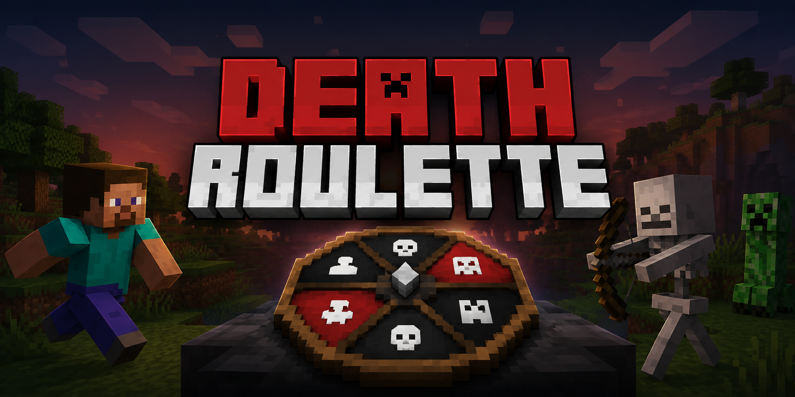

**Death Roulette**

  <!-- BANNER: Replace the placeholder below with your banner image.
       Recommended location: assets/death-roulette-banner.png
       Example:
       
  -->
  

  
  
  

Death Roulette adds a little uncertainty to survival.

Every few Minecraft days, the server starts a roulette round and randomly chooses between a player and a nearby mob. What happens next is up to the roulette.

It’s meant for SMPs, challenge worlds, or just making an otherwise normal survival world a little less predictable.

**Features**

*  Automatic roulette rounds based on Minecraft days
*  Random player or mob selection
*  Configurable chance of selecting a player
*  Separate control over passive and hostile mobs
*  Configurable mob search radius
*  Optional countdown and result sounds
*  Optional titles, action bar messages, and particles
*  Simple .properties configuration
*  Reload configuration without restarting the server
*  Built-in commands for starting, stopping, checking, and testing roulette rounds

**Commands**

The main command is:

/roulette

Available subcommands:

/roulette start
/roulette stop
/roulette status
/roulette reload
/roulette test <days>

By default, roulette commands require operator permissions.

**Configuration**

After the first launch, the mod creates:

config/deathroulette.properties

The configuration controls things such as:

* How often roulette runs
* Player selection chance
* Mob search radius
* Passive/hostile mob selection
* Titles and action bar messages
* Particles
* Roulette and death sounds
* Command permissions

After changing the configuration, use:

/roulette reload

to apply it.

**Installation**

Death Roulette is built for Minecraft 1.20.1 with Fabric.

1. Install Fabric Loader and Fabric API.
2. Download the Death Roulette .jar.
3. Put it in the server’s mods folder.
4. Start the server.

The mod is primarily intended for server-side use.

**Development**

This project is built with Gradle and uses the Fabric toolchain.

Clone the repository and run:

./gradlew build

The compiled mod will be placed in:

build/libs/

**License**

Death Roulette is released under the MIT License.

⸻

Made by IndoGeek.
